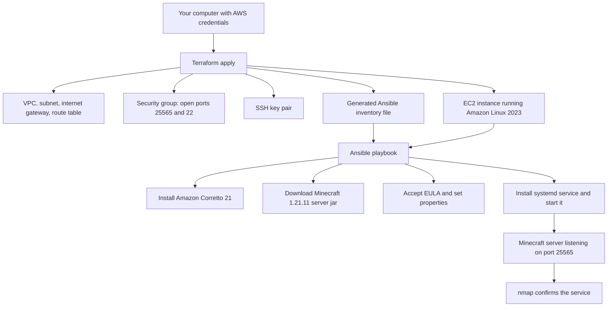

# Acme Corp Minecraft Server (Automated with Terraform and Ansible)

Raiden Lazaro

CS 312

Course Project 2: Automated Minecraft Server Deployment

This project takes the manual Minecraft server setup from Part 1 and automates it with infrastructure as code. Everything runs from scripts. You never open the AWS Management Console, and you never manually log into the server. You run a few commands, and a working Minecraft server appears on AWS.

## Background

### What we are doing

In Part 1 the server was built by hand on an Amazon Linux 2023 EC2 instance, step by step. In Part 2 we do the same job with code so it can be repeated with one command. We build a small piece of AWS infrastructure (a network and one server), install a Minecraft Java Edition server on it, set it to start on its own when the machine boots, and make sure it shuts down cleanly. At the end we confirm it is reachable with `nmap`.

To keep the two projects consistent, Part 2 uses the same choices as Part 1: Amazon Linux 2023, Amazon Corretto 21 for Java, a `t2.medium` instance, and Minecraft `1.21.11`.

### How we are doing it

The work is split into three stages, each handled by a different tool:

1. **Provision** the AWS resources with [Terraform](https://developer.hashicorp.com/terraform). This creates the network and the server.
2. **Configure** the server with [Ansible](https://docs.ansible.com/). This installs Java, downloads the Minecraft server, and sets up the service. Ansible connects to the server automatically over SSH. That is the configuration tool the assignment asks for, and it is not the same as a person opening a terminal to log in by hand.
3. **Verify** the result with [nmap](https://nmap.org/), which checks that the Minecraft port is open and names the service.

Terraform writes the server's address into an Ansible inventory file automatically, so the stages hand off to each other without any copy and paste.

## How this improves on Part 1

Part 1 set up the same server by hand, and its service file had this problem: it used `StandardInput=null` and started Java directly. With no console attached, there was no way to send the server a `stop` command, so the server was killed mid run and the world could be left half saved. That is the shutdown issue this project is asked to fix.

Part 2 fixes it by connecting the server's input to a named pipe. The service can now write real commands into that pipe while the server is running. On shutdown it sends a warning to players, runs `save-all`, then runs `stop`, and waits for the server to finish before the machine moves on. The logic lives in `ansible/templates/minecraft.service.j2`. Auto start on boot is kept from Part 1 by enabling the service.

## Pipeline diagram



If the diagram does not render, here is the same flow in words:

1. You run Terraform from your computer using your AWS credentials.
2. Terraform builds the network (a VPC, a public subnet, an internet gateway, and a route table), a security group that opens the Minecraft port and the SSH port, an SSH key pair, and one EC2 server running Amazon Linux 2023. It also writes an Ansible inventory file with the server's address.
3. Ansible reads that inventory, connects to the server, installs Amazon Corretto 21, downloads the Minecraft server jar, accepts the EULA, writes a basic configuration, installs the service, and starts it.
4. The Minecraft server listens on port 25565.
5. nmap confirms the port is open and detects the service.

## Requirements

### Tools to install

Run everything from a Linux style shell. On Windows the easiest way to get one is WSL (Windows Subsystem for Linux), explained in the Windows section below.

| Tool | Version | What it is for |
|------|---------|----------------|
| Terraform | 1.5 or newer | Builds the AWS infrastructure |
| AWS CLI | version 2 | Lets Terraform and you talk to AWS |
| Ansible | 2.15 or newer | Configures the server |
| nmap | 7.x | Confirms the server is reachable |
| Java on the server | Amazon Corretto 21 | Installed automatically by Ansible, not on your computer |

The Minecraft server version is set to `1.21.11`, the same version as Part 1, which requires Java 21. You can change the version in `ansible/playbook.yml`. If you move to Minecraft 26.1 or newer, also change the Java package in that file to `java-25-amazon-corretto-headless`.

### Credentials

Terraform and the AWS CLI read your AWS credentials from `~/.aws/credentials`. You never put keys inside the project files.

**AWS Academy Learner Lab (this is the class setup):**

1. Open the lab in Canvas and click **Start Lab**. Wait for the dot next to AWS to turn green.
2. Click **AWS Details**, then show the **AWS CLI** credentials.
3. Copy the block it gives you. It has three lines: an access key, a secret key, and a session token.
4. Paste it into `~/.aws/credentials` under a `[default]` heading. It looks like this:

   ```ini
   [default]
   aws_access_key_id=ASIA...
   aws_secret_access_key=...
   aws_session_token=...
   ```

   These credentials are temporary and expire when the lab session ends. If Terraform starts failing with an expired token error, start the lab again and paste the fresh credentials.

5. Set your region with `export AWS_DEFAULT_REGION=us-east-1` (Learner Lab uses `us-east-1`).

To check that credentials work before you start, run `aws sts get-caller-identity`. If it prints an account number, you are good.

### Things you can configure

All settings have working defaults, so you can run the project without changing anything. If you want to adjust something, copy `terraform/terraform.tfvars.example` to `terraform/terraform.tfvars` and edit it. Common options:

- `instance_type` defaults to `t2.medium` (4 GB RAM), the same size as Part 1.
- `allowed_ssh_cidr` defaults to open. In Part 1 you locked SSH to your own IP, which is safer. To do the same here, set this to your public IP with `/32` on the end.
- `aws_region` defaults to `us-east-1`.

## Repository layout

```
minecraft-server-iac/
├── README.md                     This file
├── .gitignore
├── terraform/                    Stage 1: the AWS infrastructure
│   ├── providers.tf
│   ├── variables.tf
│   ├── main.tf
│   ├── outputs.tf
│   ├── inventory.tpl             Template Terraform fills in for Ansible
│   └── terraform.tfvars.example
├── ansible/                      Stage 2: the server configuration
│   ├── playbook.yml
│   └── templates/
│       └── minecraft.service.j2  The service file with a clean shutdown
└── scripts/                      Helpers that run the stages in order
    ├── 00-deploy-all.sh
    ├── 01-provision.sh
    ├── 02-configure.sh
    ├── 03-connect.sh
    └── 99-destroy.sh
```

## How to run it

### Windows users: set up WSL first

Ansible does not run well directly on Windows, so we run everything inside WSL, which is a real Ubuntu Linux that lives next to Windows. Note that this is only your local control machine. The actual server in AWS still runs Amazon Linux 2023.

1. Open **PowerShell as Administrator** and run:

   ```powershell
   wsl --install
   ```

2. Restart your computer when it asks. Ubuntu will open and ask you to create a username and password. This is your Linux user, separate from Windows.
3. From now on, open the **Ubuntu** app and run all the commands below inside it.
4. Install the tools inside Ubuntu:

   ```bash
   sudo apt update
   sudo apt install -y software-properties-common curl gnupg unzip nmap python3-pip
   # Terraform
   wget -O - https://apt.releases.hashicorp.com/gpg | sudo gpg --dearmor -o /usr/share/keyrings/hashicorp-archive-keyring.gpg
   echo "deb [signed-by=/usr/share/keyrings/hashicorp-archive-keyring.gpg] https://apt.releases.hashicorp.com $(lsb_release -cs) main" | sudo tee /etc/apt/sources.list.d/hashicorp.list
   sudo apt update && sudo apt install -y terraform
   # AWS CLI v2
   curl "https://awscli.amazonaws.com/awscli-exe-linux-x86_64.zip" -o awscliv2.zip
   unzip awscliv2.zip && sudo ./aws/install
   # Ansible
   sudo apt install -y ansible
   ```

macOS and Linux users can install the same tools with `brew` or their package manager and skip the WSL step.

### Run the pipeline

1. Put your AWS credentials in place (see the Credentials section above).
2. Make the scripts runnable once:

   ```bash
   chmod +x scripts/*.sh
   ```

3. Run the whole thing:

   ```bash
   ./scripts/00-deploy-all.sh
   ```

   That runs the three stages in order. If you prefer to run them one at a time:

   ```bash
   ./scripts/01-provision.sh   # Terraform builds the AWS resources
   ./scripts/02-configure.sh   # Ansible installs and starts the server
   ./scripts/03-connect.sh     # nmap confirms the server is up
   ```

### What each command does

- `terraform init` downloads the providers Terraform needs. The script does this for you.
- `terraform apply` reads the files in `terraform/` and creates the network, security group, key, and server in AWS. It then writes the server's address into `ansible/inventory.ini`.
- `ansible-playbook -i inventory.ini playbook.yml` connects to the new server and installs everything. It waits for the server to finish booting first.
- `nmap -sV -Pn -p T:25565 <ip>` scans the Minecraft port. `-sV` asks nmap to identify the service, `-Pn` tells it to skip the ping check, and `-p T:25565` limits it to the Minecraft TCP port.

## How to connect to the server

After the pipeline finishes, get your address:

```bash
cd terraform
terraform output minecraft_connect_address
```

You can confirm it is open at any time with the verify script, which runs the `nmap` command the assignment asks for:

```bash
./scripts/03-connect.sh
```

A working result shows port 25565 as `open` and lists the service as Minecraft.

To actually play, open the Minecraft Java Edition client, choose **Multiplayer**, then **Add Server**, and paste the address (the public IP followed by `:25565`).

## How the server starts and stops

The server runs as a systemd service called `minecraft`. Two parts of the assignment are handled here:

- **Starts on reboot.** The service is enabled, which means systemd starts it again on its own every time the machine boots. There is no manual step. This carries over from Part 1.
- **Stops cleanly.** This is the fix described in the "How this improves on Part 1" section. The server input is connected to a named pipe, so on stop the service sends `save-all` and `stop` and waits for the world to finish saving.

## Cleaning up

AWS keeps charging credits while the server runs. When you are done, including after your recording, remove everything:

```bash
./scripts/99-destroy.sh
```

## What this project does not do (on purpose)

To follow the assignment rules, this project never uses the AWS Management Console, never uses the EC2 `user_data` field to load scripts, and never has a person manually SSH into the server. All AWS work goes through the AWS CLI and Terraform, and all server configuration goes through Ansible.

## Resources and sources

- Terraform AWS provider documentation: https://registry.terraform.io/providers/hashicorp/aws/latest/docs
- Terraform tls provider (for the generated key): https://registry.terraform.io/providers/hashicorp/tls/latest/docs
- Ansible documentation: https://docs.ansible.com/
- Amazon Corretto 21 on Amazon Linux: https://docs.aws.amazon.com/corretto/latest/corretto-21-ug/what-is-corretto-21.html
- Minecraft Wiki, setting up a Java Edition server: https://minecraft.wiki/w/Tutorial:Setting_up_a_Java_Edition_server
- Minecraft Java version requirements: https://minecraft.wiki/w/Tutorial:Update_Java
- Mojang version manifest used to find the server jar: https://launchermeta.mojang.com/mc/game/version_manifest_v2.json
- Sending commands to a Minecraft server through a named pipe (graceful stop): https://minecraft.wiki/w/Tutorial:Server_startup_script
- nmap reference guide: https://nmap.org/book/man.html
